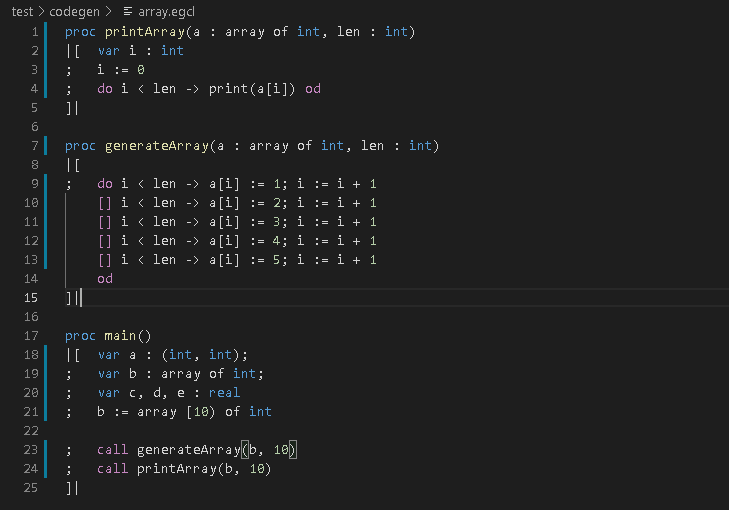

# EGCL Syntax Highlighter README

This syntax highlighter was created for the **Extended Guarded Command Programming** Language that I have worked on. To **install** it just create a new folder inside `.vscode/extensions` (Linux) or `AppData\Local\Programs\Microsoft VS Code\resources\app\extensions` (Windows), and copy paste the contents of this repository into it.

## Features

-   Dynamic syntax highlighting 
-   Integration with the default VSCode Dark+ Color Theme

## Requirements

- VSCode installed

## Known Issues

- While you write a function, all the things below become yellow until you write the first '(' character.
